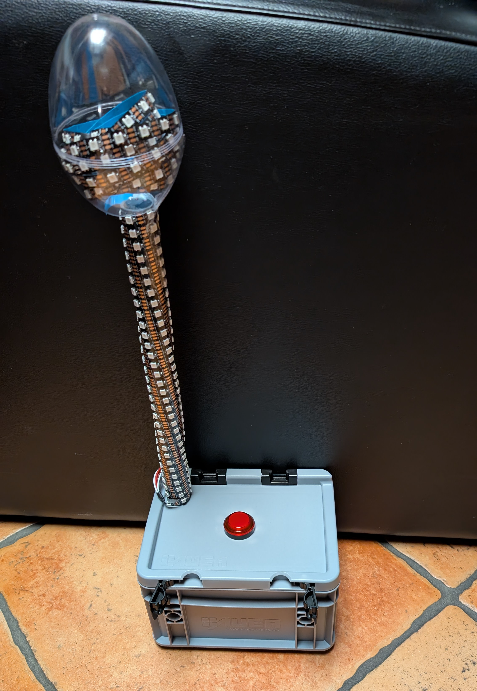

Maker Media GmbH

***

# Eierlege-Game

**Das schnelle Drücken eines Tasters füllt eine LED-Leiste. Umgesetzt mit einem ESP32, macht die Make-Redaktion mit diesem bekannten Ausdauerspiel eines ihrer künstlerischen Projekte auf der Maker Faire Ruhr interaktiv.**

Der vollständige Artikel zum Projekt steht in der **[Make-Ausgabe 2/25 ab Seite 82](https://www.heise.de/select/make/2025/2)**.
